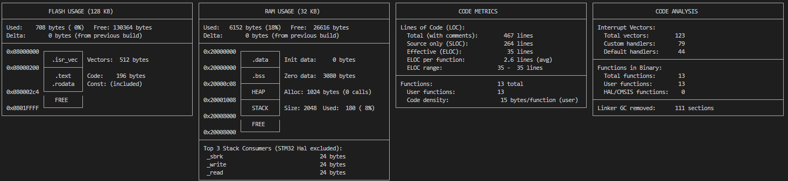

# From build to flash

## The building

First code to compile in `main.cpp`
```cpp
#include <stdint.h>

int main(void)
{
    static uint32_t cnt = 0u;

    while(1)
    {
        cnt = cnt + 1;
    }
}
```

To build
```bash
arm-none-eabi-gcc \
  -mcpu=cortex-m4 -mthumb \
  -std=c++17 -O0 -g \
  -ffreestanding -nostdlib \
  -c main.cpp -o main.o
# -mcpu=cortex-m4 : generate code for Cortex-M4.
# -mthumb : use Thumb instruction set (what Cortex-M actually runs).
# -O0 : no optimizations, so the assembly is “literal” and easier to read.
# -g : include debug info (handy later with GDB).
# -ffreestanding : tell the compiler there is no hosted OS, no normal main/argc/argv conventions.
# -nostdlib : don’t try to link libc, libstdc++, etc.
```

To disassemble
```bash 
arm-none-eabi-objdump -d -S main.o > main.asm
```

Which gives
```asm
0:	b480      	push	{r7}        ; decrement sp (stack ptr) by 4 bytes and save r7 at stack top, to be devel after the function as ended
2:	af00      	add	r7, sp, #0    ; set r7 as the fp (frame ptr) for this funtion (add r7 = sp + 0x0 = sp)
4:	4b02      	ldr	r3, [pc, #8]	; (10 <main+0x10>) load [program_counter(0x4)+4]+0x8 into r3 (adress), why +4 ? Because pc is always 4bytes ahead
6:	681b      	ldr	r3, [r3, #0]  ; load r3 from &r3
8:	3301      	adds	r3, #1      ; r3+0x1
a:	4a01      	ldr	r2, [pc, #4]	; (10 <main+0x10>)=0xa+0x4+0x4!=0x10 load r2 with pc+0x4
c:	6013      	str	r3, [r2, #0]  ; store r3 at r2 memory with 0x0 offset
e:	e7f9      	b.n	4 <main+0x4>  ; b (branch) .n (narrow - 16bits), it is not e-0xa(10), because the disassebler always show the absolute target adress, thus, 4 is printed
10:	00000000 	.word	0x00000000
```

In `0: b480   push {r7}`, `0:` is the adress of the instruction inside the section being disassembled. It increase by two because some Thumb instruction are 32-bits (4 bytes long) and other 16-bits (2 bytes long), and it kept them align. `b480` is the raw machine code (opcode) for the given instruction (here: 2 byte long). Here, in 0x00 live `80`where in 0x01 lives `b4`.

## The linking

Refer to `minimal_linker.ld` script and the `CMakeLists.txt`, to get all linking step and build tags.
You can build the whole system using:
```bash
cd build
rm -rf *
cmake ..
make
# Or the on liner !!! BE SURE TO BE ON BUILD TO NOT ERASE EVERYTHING
rm -rf * && cmake .. && make
```

You should see the debug metric plotted. 

To change from horizontal, go in the `CMakeLists.txt` file and look for
```bash
# COMMAND bash ${CMAKE_SOURCE_DIR}/memory_report.sh $<TARGET_FILE:${PROJECT_NAME}.elf>
COMMAND bash ${CMAKE_SOURCE_DIR}/memory_report.sh $<TARGET_FILE:${PROJECT_NAME}.elf> horizontal
```

## The flashing

First activate OpenOCD client on the computer by connecting to the server on the STM
```bash
openocd -f interface/stlink.cfg -f target/stm32g4x.cfg -c 'adapter speed 100'
```

Then connect to the debuger loader via GDB, the full list of command can be find in the pdf
```bash
# First, start with a given link file
gdb-multiarch ESC_TOOLKIT_TARGET_STM32G431RB.elf
# Then connect to the remote
target remote localhost:3333
# Halt just after reset ensure that the program counter is set to the reset vector and that the CPU is stopped before any application can be executed
monitor reset halt 
# And load the application 
load
# And then continue
continue

# To change file or load it after the GDB call
file ESC_TOOLKIT_TARGET_STM32G431RB.elf
```


